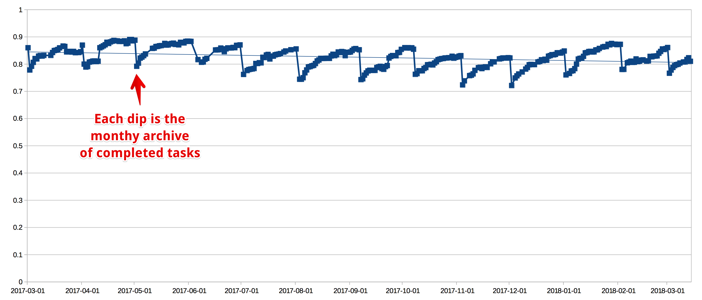

# Completed Tasks Tracker for Omnifocus

This Launchagent creates a CSV with the date, the number of completed tasks, the number of total tasks, and the ratio between the two. Use it to look back at your life to see if you are reaching your goals or overcommitting to projects.

Here is an example of a chart showing a year's worth of data. Since the trend is downward, we can assume we're taking on too much.

## Installation

* Copy `ca.furrypaws.CompletedTasks.plist` to `~/Library/LaunchAgents`.
* Edit the plist, changing `PATH-TO` to match where the script and the CSV should be.
* Run `launchctl load ~/Library/LaunchAgents/ca.furrypaws.CompletedTasks.plist`
* The next day at 8AM, or the first moment after your Mac is awake, the CSV will start to be populated.
